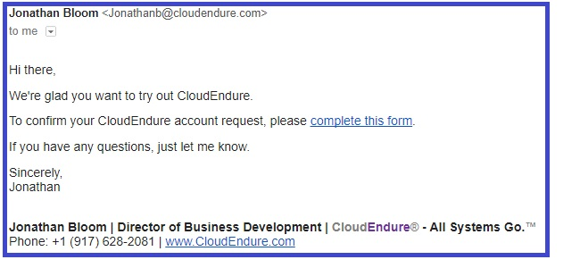
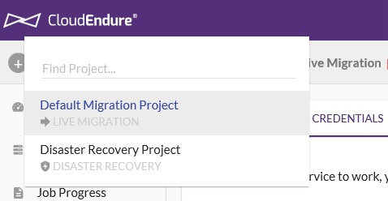
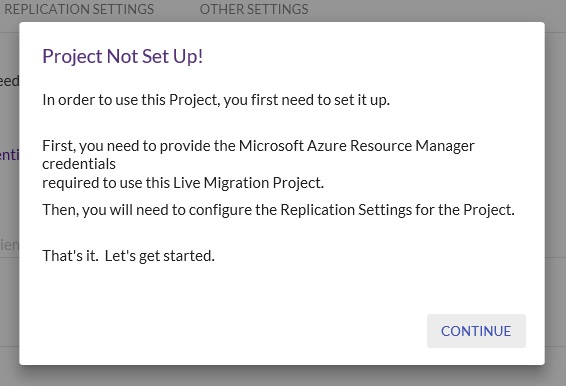

# Performing a Linux migration to Azure with CloudEndure

## Expected Outcome

This challenge will give you practical experience migrating a running host to Microsoft Azure. While this virtual machine is technically already running in Azure, it is running in a nested virtualization configuration on your host.

Inside the CentOS Linux host that you are using as your desktop, there is a running virtual machine entitled "migrate-host".  It, too, is a CentOS virtual machine running under the KVM hypervisor. Microsoft has partnered with CloudEndure to provide access to their migration toolset to showcase its capabilities and give you hands-on experience with the migration process.  At the end of the challenge, you should have a new virtual machine created in Microsoft Azure which you can SSH to and verify that it is, indeed, the same host.

The source host to be migrated can be an on-premise physical host, a virtual machine on any popular hypervisor (VMWare, KVM, etc), or it may also exist in another public cloud. CloudEndure is agnostic to the source environment and performs a block-level copy of the host into your Azure subscription as part of the replication process.

## Process

1. <strong>Register for a CloudEndure account</strong>
    * Visit & fill out the registration page located at:  https://azure-register.cloudendure.com/
    * Check the account for the e-mail address which you entered, and open the email from "Jonathan Bloom" at CloudEndure regarding "Confirm your CloudEndure account request"
    * Click on the link in the e-mail to "complete this form"

      

2. <strong>Log in to the CloudEndure Console</strong>
    * Login:  http://www.cloudendure.com

3. <strong>You will be presented with a dashboard which will allow you to select the type of project you wish you control.</strong>

&nbsp;      

   *<strong>Select "Default Migration Project"</strong>

&nbsp;      

   *<strong>You will then receive an alert message indicating that the CloudEndure console has not yet been configured. You may safely click "Continue" as we will configure the console in the next step.</strong>

&nbsp;      

4. 
